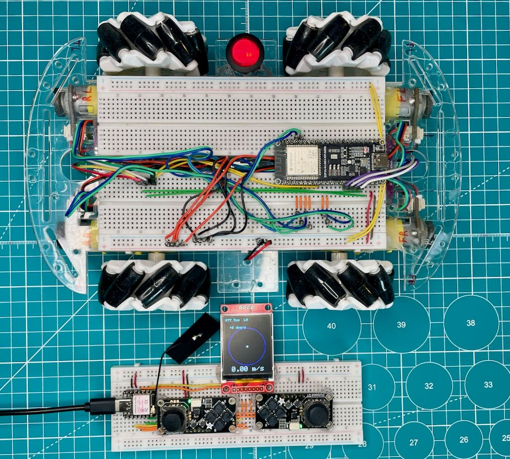
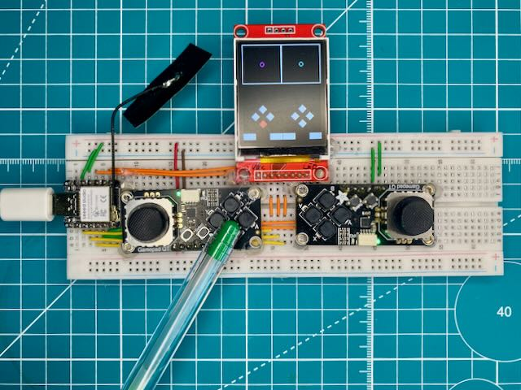
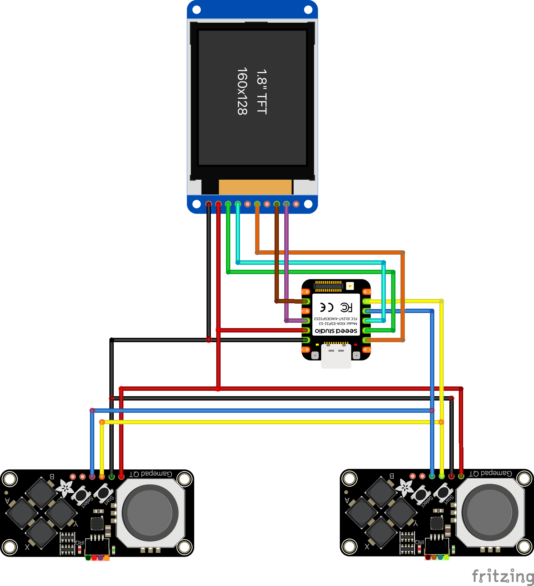

# Pad Controller — Xiao ESP32-S3 + ESP-NOW + FreeRTOS

<p align="center">
  
  <br/>
  <em>One protocol, two devices. The screen is live: round trip 5 ms, no
  telemetry lost, and the echo dot resting in the middle of the stick ring.</em>
</p>

This handheld controller is built on a Xiao ESP32-S3 and talks over ESP-NOW. It
reads two analogue joysticks through Adafruit Seesaw modules (I2C) and draws
live data on a 1.8" ST7735 TFT using TFT_eSPI. Everything runs under FreeRTOS.

It sends control frames to a mecanum-wheel robot platform
([ESP32S3_Mecanum_Base](https://github.com/CableAndCode/ESP32S3_Mecanum_Base)) and
**doubles as the system's diagnostic display** — telemetry coming back from the
platform is shown on the pad's own screen, so no separate monitor device is
needed.

---

## What it shows

Four screens, cycled with SELECT (left pad forwards, right pad backwards).
START is deliberately left free, reserved for a future emergency stop.

| Screen | Contents |
|---|---|
| **Drive** | Full-screen radar: the commanded travel vector (cyan) and the actual one reconstructed from wheel revolutions (white), rotation arcs along the rim, speed in m/s and rotation in °/s |
| **Wheels** | Per-wheel bar of measured RPM with a marker for the commanded value — the gap between them shows which wheel is not keeping up |
| **Link** | Range bar, ACK loss over the last 100 transmissions, telemetry frame loss, protocol error count |
| **Buttons** | A plain test that every button reports |

A status bar sits on every screen: warnings take priority, and when all is well
it shows the round-trip time and frame loss.

**The echo dot.** On the non-radar screens each stick ring carries a white dot
drawn from the axis values the *platform sent back*. Centred means the link is
alive and keeping up; trailing means latency; jumping means losses. It is one
pixel instead of three numbers to read while driving — and it is also the only
proof that the platform is reading the right fields out of the frame, which a
matching protocol version alone does not guarantee.

---

## Components




*The prototype and its wiring: two Adafruit Seesaw joysticks, a Xiao ESP32-S3
and a 1.8" ST7735 TFT display.*

| Part | Model / type | Notes |
|---|---|---|
| Main MCU | Seeed Studio Xiao ESP32-S3 | ESP-NOW, FreeRTOS, I2C |
| Joystick modules (×2) | Adafruit Mini I2C Gamepad QT (PID 5743) | I2C, buttons included |
| TFT display | 1.8" SPI TFT (ST7735) | 128×160, driven with TFT_eSPI |
| Buttons | Built into the Seesaw modules | read as a digital bitmask |
| Wiring | Dupont / soldered | breadboard-friendly |

Seesaw pinout, I2C addresses and ADC details are collected in
[docs/gamepad-qt.md](docs/gamepad-qt.md).

### Pin connections

| Signal | Xiao ESP32-S3 pin | Device |
|---|---|---|
| I2C SDA | GPIO 5 | both Seesaw modules |
| I2C SCL | GPIO 6 | both Seesaw modules |
| TFT SCLK | GPIO 7 | TFT display |
| TFT MOSI | GPIO 9 | TFT display |
| TFT DC | GPIO 4 | TFT display |
| TFT CS | GPIO 2 | TFT display |
| TFT RESET | GPIO 3 | TFT display |

---

## Things worth knowing before changing anything

- **`src/messages.h` must be byte-identical to the copy in the platform's
  repository.** It defines the ESP-NOW protocol, and a `static_assert` on every
  struct size turns a one-sided edit into a compile error. The version travels
  in `MSG_HELLO`, and the platform refuses to drive until it has seen a matching
  one — so a version mismatch shows up as a stationary robot and a red line on
  this screen, rather than as guesswork.
- **The task periods must stay close together.** Sticks, transmit, telemetry and
  drawing all run at 50 Hz. When transmit, telemetry and drawing ran at 20 Hz,
  three unsynchronised 50 ms loops drifted in phase and the interval between
  echo-dot updates varied between 0 and 100 ms — the dot stuttered on a healthy
  link with zero losses. Slowing any of these tasks brings that back.
- **`createSprite()` returns `nullptr` when out of memory and reports nothing.**
  The sprite simply stops drawing. `begin()` checks every allocation for exactly
  that reason.
- **The lower panel is one shared sprite.** Every screen draws into the same
  buffer; three more panels in sprites of their own would cost over 50 kB.
- Screen selection is **local to the pad** and costs no bits on air — which view
  the operator is looking at is no business of the platform's.

`CLAUDE.md` carries the long-form version, including why each decision was made.

---

## Build and flash

Requires [PlatformIO](https://platformio.org/).

```bash
git clone https://github.com/CableAndCode/Pad_Adafruit_Xiao.git
cd Pad_Adafruit_Xiao
pio run -t upload
```

**Display configuration.** No manual editing of the TFT_eSPI library is needed.
All display settings (driver, pins, SPI speed, fonts) are passed as
`build_flags` in `platformio.ini` and applied automatically.

**MAC addresses.** The project builds out of the box using the placeholder
addresses in `src/mac_addresses.h`. Edit that file with the MAC addresses of
your own devices, or create `src/mac_addresses_private.h` — if present it takes
precedence, and it is excluded from version control.

A `TOUCH_CS` warning during the build is expected; the ST7735 panel used here
has no touch layer.

Every push and pull request is built by GitHub Actions.

---

## License

Released under the MIT License. See [LICENSE](LICENSE).

Third-party libraries retain their own licenses:
- [TFT_eSPI](https://github.com/Bodmer/TFT_eSPI) – FreeBSD (BSD 2-clause)
- [Adafruit seesaw](https://github.com/adafruit/Adafruit_Seesaw) – MIT
- [Adafruit BusIO](https://github.com/adafruit/Adafruit_BusIO) – MIT
- [Adafruit ST7735/ST7789](https://github.com/adafruit/Adafruit-ST7735-Library) – BSD
- ESP32 Arduino Core (including ESP-NOW and WiFi) – Apache 2.0 / LGPL
